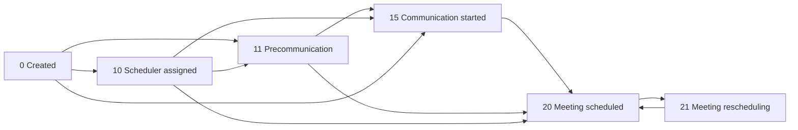

# CRM Lead Intake, Fields & Stage Guide (Created → Meeting Scheduled)

**Audience:** Operations, integrations, and external auditors  
**Scope:** New leads only (`public.leads`). Covers webhook intake, non-financial fields, meetings, unactivation, and workflow from **stage 0 (Created)** through **stage 20 (Meeting scheduled)** and **stage 21 (Meeting rescheduling)**.  
**Excludes:** Payment plans, proforma, collection, invoices, and other finance tables

**Last updated from codebase:** May 2026

---

## 1. Executive summary

| Topic                                | How it works in this CRM                                                                                  |
| ------------------------------------ | --------------------------------------------------------------------------------------------------------- |
| **Lead table**                       | `public.leads` (`id` `uuid`, `lead_number` `text` `L{n}`)                                                 |
| **Inbound automation**               | Node backend `POST /api/hook/catch` → Supabase RPC `create_lead_with_source_validation`                   |
| **Initial stage on webhook create**  | `leads.stage = 0` (“Created”)                                                                             |
| **Marketing source**                 | `leads.source_id` (`bigint`) → `misc_leadsource.id`                                                       |
| **Stage history**                    | `public.leads_leadstage` (`newlead_id` `uuid`, `stage` `bigint`)                                          |
| **Meeting scheduled**                | `leads.stage` (`bigint`) = `20` after a meeting row is saved                                              |
| **Meeting rescheduling**             | `leads.stage` (`bigint`) = `21` when a meeting is **canceled** without a replacement (exceptions in §4.7) |
| **Unactivation**                     | `leads.status` (`text`) = `'inactive'` + reason fields; **stage is not changed**                          |
| **Auto stage bumps (communication)** | PostgreSQL function `evaluate_and_update_stage` on emails / WhatsApp / calls / `manual_interactions`      |

---

## 2. How leads enter the system (webhook automation)

### 2.1 Main entry point

| Item                | Value                                                                                    |
| ------------------- | ---------------------------------------------------------------------------------------- |
| **HTTP**            | `POST`                                                                                   |
| **Path**            | `/api/hook/catch`                                                                        |
| **Production base** | `https://leadify-crm-backend.onrender.com` (see `WEBHOOK_API_DOCUMENTATION.md`)          |
| **Handler**         | `backend/src/controllers/webhookController.js` → `catchFormData`                         |
| **DB function**     | `create_lead_with_source_validation(...)` (`sql/create_lead_with_source_validation.sql`) |
| **Enable/disable**  | `webhook_settings` table (admin UI: Webhook Settings)                                    |

Payload can arrive as JSON body, nested `body.query`, or URL query string (same fields).

### 2.2 Webhook request fields → database

| Webhook field | Aliases               | Required | Column              | Type     | Notes                                                                  |
| ------------- | --------------------- | -------- | ------------------- | -------- | ---------------------------------------------------------------------- |
| `name`        | —                     | **Yes**  | `leads.name`        | `text`   | Only hard-required field in handler                                    |
| `email`       | —                     | No\*     | `leads.email`       | `text`   | \*Strongly expected for operations                                     |
| `phone`       | —                     | No       | `leads.phone`       | `text`   |                                                                        |
| `topic`       | —                     | No       | `leads.topic`       | `text`   | Overridden by `misc_leadsource.default_topic` when source code matches |
| `facts`       | `desc`                | No       | `leads.facts`       | `text`   | Country/URL sometimes parsed from here                                 |
| `language`    | —                     | No       | `leads.language_id` | `bigint` | Also sets `leads.language` (`text`) on insert                          |
| `source_code` | `lead_source`         | No\*\*   | `leads.source_id`   | `bigint` | **Must resolve** to active `misc_leadsource.code`                      |
| `source_id`   | `lead_source_id`      | No       | `leads.source_id`   | `bigint` | FK → `misc_leadsource.id`                                              |
| `country`     | `ISO`                 | No       | `leads.country_id`  | `bigint` | ISO-2; also parsed from `facts`                                        |
| `url`         | `ref_url`             | No       | `leads.source_url`  | `text`   | Landing / referrer URL                                                 |
| `utm_params`  | object / query string | No       | `leads.utm_params`  | `jsonb`  | See §2.3                                                               |
| —             | —                     | —        | `leads.stage`       | `bigint` | **Always `0` on insert**                                               |
| —             | —                     | —        | `leads.status`      | `text`   | `'active'`                                                             |
| —             | —                     | —        | `leads.created_by`  | `text`   | `'webhook@system'`                                                     |
| —             | —                     | —        | `leads.category_id` | `bigint` | From `misc_leadsource.default_category_id`                             |

**Source resolution (required for webhook):** Provide `source_code` / `lead_source` (numeric `misc_leadsource.code`), or `source_id`, or exact source display name matching `misc_leadsource`, or env `WEBHOOK_DEFAULT_SOURCE_CODE`. The CRM stores **`source_id`**; look up name via `misc_leadsource`.

**Post-insert (same request):** optional `UPDATE` on `leads` for `facts` and `utm_params`.

### 2.3 UTM / ads parameters (`leads.utm_params`)

Stored as JSONB when present. Known keys collected individually or via raw `utm_params`:

`lpurl`, `targetid`, `matchtype`, `device`, `campaignid`, `adgroupid`, `keyword`, `target`, `subid` (plus any extra keys in a provided object).

### 2.4 Automatic side effects on webhook create

| Step | What happens                                                                                                               |
| ---- | -------------------------------------------------------------------------------------------------------------------------- |
| 1    | RPC inserts row in `leads` with **stage 0**                                                                                |
| 2    | Trigger `trg_auto_create_main_contact` creates `leads_contact` + `lead_leadcontact` (main contact = lead name/email/phone) |
| 3    | Optional update: `facts`, `utm_params`                                                                                     |

Reference: `create_auto_contact_trigger.sql`, `sql/create_lead_with_source_validation.sql`.

### 2.5 Other inbound channels

| Channel                | Entry                                     | Initial stage / notes                                              |
| ---------------------- | ----------------------------------------- | ------------------------------------------------------------------ |
| **Facebook Lead Ads**  | Facebook webhook → same RPC               | Stage 0; `source_id` from form mapping / env                       |
| **Manual UI**          | Clients → New lead, Scheduler tool        | Often stage 0                                                      |
| **WhatsApp**           | Chat lead creation (`whatsappController`) | Separate path                                                      |
| **Double lead review** | `double_leads`                            | Duplicate queue (detection disabled in webhook at time of writing) |

### 2.6 Facebook webhook (summary)

- Maps form → `create_lead_with_source_validation` with `p_created_by: 'facebook@webhook'`, language `EN`.
- Requires configured source per form (`FACEBOOK_FORM_SOURCE_CODES` / `FACEBOOK_DEFAULT_SOURCE_CODE`).

---

## 3. Stage model (numeric IDs)

Stages are stored in `leads.stage` (`bigint`). Display names come from `lead_stages` (`id` `bigint` / text slug such as `meeting_scheduled`, `meeting_rescheduling`).

| Stage ID | Display name          | Role in early funnel                                     |
| -------- | --------------------- | -------------------------------------------------------- |
| **0**    | Created               | New lead; **webhook default**                            |
| **10**   | Scheduler assigned    | Scheduler owner set on lead                              |
| **11**   | Precommunication      | One-way outreach, no qualifying call yet                 |
| **15**   | Communication started | Two-way communication + long call                        |
| **20**   | Meeting scheduled     | At least one active meeting booked                       |
| **21**   | Meeting rescheduling  | Meeting canceled; replacement not yet booked (see §4.7)  |
| **55**   | Another meeting       | Subsequent meeting on same lead; reschedule rules differ |

---

## 4. Stage progression guide: 0 (Created) → 20 (Meeting scheduled) → 21 (Rescheduling)

### 4.1 Stage 0 — Created

| Aspect                | Detail                                                                                                    |
| --------------------- | --------------------------------------------------------------------------------------------------------- |
| **When set**          | Webhook RPC insert; manual create                                                                         |
| **Column**            | `leads.stage` (`bigint`) = `0`                                                                            |
| **What should exist** | `name` (`text`), `source_id` (`bigint`), `language_id` (`bigint`), `category_id` (`bigint`), main contact |
| **Typical roles**     | Unassigned; no `scheduler` yet                                                                            |
| **User actions**      | Review lead, confirm category, assign scheduler                                                           |

---

### 4.2 Stage 10 — Scheduler assigned

| Aspect           | Detail                                                                              |
| ---------------- | ----------------------------------------------------------------------------------- |
| **When set**     | User assigns **Scheduler** on client                                                |
| **Columns**      | `leads.scheduler` (`text`), `leads.stage` (`bigint`) = `10`                         |
| **History**      | `recordLeadStageChange` → `leads_leadstage` (`newlead_id` `uuid`, `stage` `bigint`) |
| **Prerequisite** | `category_id` often required before updates                                         |
| **Does not**     | Book a meeting                                                                      |

---

### 4.3 Stage 11 — Precommunication (often automatic)

| Aspect                  | Detail                                                                                                                                         |
| ----------------------- | ---------------------------------------------------------------------------------------------------------------------------------------------- |
| **When set**            | **Database trigger** after interaction saved                                                                                                   |
| **Conditions**          | Current stage ∈ {0, 10}; at least one interaction; **only outbound OR only inbound**; **no** call ≥ 2 minutes                                  |
| **Interaction sources** | `emails` (`client_id` `uuid`), `whatsapp_messages` (`lead_id` `uuid`), `call_logs` (`client_id` `uuid`), `leads.manual_interactions` (`jsonb`) |
| **Columns updated**     | `leads.stage` (`bigint`) = `11`, `stage_changed_by` (`varchar`), `stage_changed_at` (`timestamptz`)                                            |

Reference: `sql/stage_transition_function.sql`, `sql/README_stage_transition.md`.

---

### 4.4 Stage 15 — Communication started (often automatic)

| Aspect              | Detail                                                                                                     |
| ------------------- | ---------------------------------------------------------------------------------------------------------- |
| **When set**        | **Database trigger**                                                                                       |
| **Conditions**      | Current stage ∈ {0, 10, 11}; **both** outbound and inbound; at least one **call** duration **> 2 minutes** |
| **Columns updated** | `leads.stage` (`bigint`) = `15`, `stage_changed_by` (`varchar`), `stage_changed_at` (`timestamptz`)        |

---

### 4.5 Stage 20 — Meeting scheduled

| Aspect                  | Detail                                                                                                                  |
| ----------------------- | ----------------------------------------------------------------------------------------------------------------------- |
| **When set**            | User schedules a meeting (Schedule drawer / Meeting tab)                                                                |
| **Prerequisite**        | Insert row in `meetings` with `client_id` (`uuid`) = `leads.id` (`uuid`)                                                |
| **Column**              | `leads.stage` (`bigint`) = `20` (slug `meeting_scheduled`)                                                              |
| **Also updated**        | `scheduler` (`text`), `manager` / `helper` (`text`), `stage_changed_by` (`varchar`), `stage_changed_at` (`timestamptz`) |
| **History**             | `leads_leadstage` row for stage 20                                                                                      |
| **Subsequent meetings** | May target stage **55** (“Another meeting”) when scheduling another session                                             |

**Critical:** Stage 20 requires a **`meetings`** row, not only denormalized fields on `leads`.

#### Scheduling writes (summary)

**`meetings`**

| Column                   | Type          | Purpose                                                        |
| ------------------------ | ------------- | -------------------------------------------------------------- |
| `client_id`              | `uuid`        | FK → `leads.id`                                                |
| `meeting_date`           | `date`        | Meeting date                                                   |
| `meeting_time`           | `text`        | Meeting time (e.g. `09:00`)                                    |
| `meeting_location`       | `text`        | Location name                                                  |
| `meeting_manager`        | `text`        | Manager                                                        |
| `helper`                 | `text`        | Helper                                                         |
| `meeting_currency`       | `text`        | Currency code/symbol                                           |
| `meeting_amount`         | `numeric`     | Amount                                                         |
| `teams_meeting_url`      | `text`        | Teams join URL                                                 |
| `meeting_brief`          | `text`        | Brief / notes                                                  |
| `attendance_probability` | `text`        | e.g. Low / Medium / High                                       |
| `complexity`             | `text`        | e.g. Simple / Complex                                          |
| `car_number`             | `text`        | Parking / car                                                  |
| `scheduler`              | `text`        | Who scheduled                                                  |
| `calendar_type`          | `varchar(20)` | `potential_client` \| `active_client` \| `staff` \| `external` |
| `custom_link`            | `text`        | Custom online link                                             |
| `custom_address`         | `text`        | Custom address (location type)                                 |
| `manual_address`         | `text`        | Free-text address for templates                                |

**`leads` (on schedule)**

| Column              | Type           | Purpose                               |
| ------------------- | -------------- | ------------------------------------- |
| `stage`             | `bigint`       | `20`                                  |
| `scheduler`         | `text`         | Current scheduler                     |
| `manager`           | `text`         | Manager (often employee id as string) |
| `helper`            | `text`         | Helper                                |
| `stage_changed_by`  | `varchar(255)` | Actor                                 |
| `stage_changed_at`  | `timestamptz`  | When stage changed                    |
| `meeting_date`      | `date`         | Mirror (optional)                     |
| `meeting_time`      | `text`         | Mirror (optional)                     |
| `meeting_location`  | `text`         | Mirror (optional)                     |
| `teams_meeting_url` | `text`         | Mirror (optional)                     |

---

### 4.6 Between-stage checklist (operations)

| From → To           | What to change / use                                                                  |
| ------------------- | ------------------------------------------------------------------------------------- |
| **→ 10**            | `leads.scheduler` (`text`); `leads.stage` (`bigint`) = `10`; `leads_leadstage` row    |
| **→ 11**            | Outbound comm while `stage` ∈ {0, 10}; DB trigger or manual `stage` (`bigint`) = `11` |
| **→ 15**            | Two-way comm + call >2 min; DB trigger or manual `stage` = `15`                       |
| **→ 20**            | Insert `meetings` (`client_id` `uuid`) + `leads.stage` = `20`                         |
| **→ 21**            | `meetings.status` (`text`) = `'canceled'`; `leads.stage` = `21` (§4.7)                |
| **21 → 20**         | New `meetings` row; `leads.stage` = `20`                                              |
| **Manual override** | Stage dropdown; `recordLeadStageChange` → `leads_leadstage`                           |

Stages 11 and 15 can be skipped if staff schedules directly from 0/10.

---

### 4.7 Stage 21 — Meeting rescheduling

| Aspect                     | Detail                                                                                                                                                   |
| -------------------------- | -------------------------------------------------------------------------------------------------------------------------------------------------------- |
| **Meaning**                | A previously scheduled client meeting was **canceled** and the lead is in a “waiting to rebook” state—not the same as having a new date on the calendar. |
| **Slug**                   | `meeting_rescheduling` (numeric **21**)                                                                                                                  |
| **When set (cancel only)** | Reschedule drawer → **Cancel**: `meetings.status` (`text`) → `'canceled'`, then `leads.stage` (`bigint`) = `21`                                          |
| **When NOT set**           | Lead already at stage **55** (“Another meeting”) — stage stays **55** on cancel                                                                          |
| **Optional**               | Notify client by email (template or fallback); saved to `emails` when sent via backend                                                                   |
| **After cancel**           | Lead remains in pipeline at stage 21 until staff books again                                                                                             |

**Reschedule flow (cancel + new meeting):**

1. System finds oldest upcoming non-canceled `meetings` row for `client_id` and sets `status = 'canceled'`.
2. Inserts **new** `meetings` row with new date/time/location.
3. Sets `leads.stage = 20` (**Meeting scheduled**), not 21 — unless lead is in **Another meeting (55)**, in which case stage is unchanged.
4. May refresh Teams/Outlook event and send client notification if enabled.

**Operational distinction:**

| Action                        | Typical result stage              |
| ----------------------------- | --------------------------------- |
| Cancel meeting, no new date   | **21** (except stage 55)          |
| Cancel old + book new meeting | **20** (or unchanged if stage 55) |

---

## 5. Unactivation (new leads)

Unactivation marks a lead as **inactive** for scheduling and follow-up. It is separate from pipeline **stage** (stage is **not** updated on unactivate/activate).

### 5.1 How to unactivate (UI)

1. Open lead → stage control → choose **Unactivate** (or equivalent action opening the modal).
2. Select **Reason for unactivation** (required).
3. Enter **Description** (required) — stored in `deactivate_notes`.
4. Confirm → updates `leads` row.

### 5.2 Fields written on unactivation

| Column                | Type          | Purpose                                            |
| --------------------- | ------------- | -------------------------------------------------- |
| `status`              | `text`        | Set to `'inactive'`; UI treats this as unactivated |
| `unactivated_at`      | `timestamptz` | When unactivation occurred                         |
| `unactivated_by`      | `text`        | Full name of user who unactivated                  |
| `unactivation_reason` | `text`        | Selected reason (see §5.3)                         |
| `deactivate_notes`    | `text`        | Free-text description (required in UI)             |

**Not changed:** `leads.stage` (`bigint`) — remains at current pipeline stage (e.g. 10 or 20).

### 5.3 Allowed `unactivation_reason` values (UI dropdown)

Stored in `unactivation_reason` (`text`).

| Value                  | Type   |
| ---------------------- | ------ |
| `test`                 | `text` |
| `spam`                 | `text` |
| `double - same source` | `text` |
| `double -diff. source` | `text` |
| `no intent`            | `text` |
| `non active category`  | `text` |
| `IrrelevantBackground` | `text` |
| `incorrect contact`    | `text` |
| `no legal eligibility` | `text` |
| `no profitability`     | `text` |
| `can't be reached`     | `text` |
| `expired`              | `text` |

Stored as plain text in `unactivation_reason` (not a separate reason-id column on new leads).

### 5.4 Reactivation (activate)

| Column                | Type          | Value on activate |
| --------------------- | ------------- | ----------------- |
| `status`              | `text`        | `'active'`        |
| `unactivated_at`      | `timestamptz` | `NULL`            |
| `unactivated_by`      | `text`        | `NULL`            |
| `unactivation_reason` | `text`        | `NULL`            |

(`deactivate_notes` may remain in DB for audit unless cleared by a separate process—activation handler clears the three unactivation fields above.)

### 5.5 Reporting / filters

- Scheduler and list views often exclude rows where `unactivated_at IS NULL` is false or `status = 'inactive'`.
- Marketing reports may group by `unactivation_reason`.

---

## 6. Table reference — `leads`

> Finance columns (`balance`, `proposal_*`, payment-related) are omitted.  
> **Types:** PostgreSQL `public.leads`. `stage` is **`bigint`** (FK to `lead_stages.id` where configured).

### 6.1 Identity & numbering

| Column        | Type     | Purpose                                |
| ------------- | -------- | -------------------------------------- |
| `id`          | `uuid`   | Primary key                            |
| `lead_number` | `text`   | Public id `L{n}` (unique, not null)    |
| `manual_id`   | `bigint` | Optional internal id                   |
| `master_id`   | `text`   | Master grouping for sub-leads `L123/2` |
| `name`        | `text`   | Lead / primary contact name            |
| `email`       | `text`   | Primary email                          |
| `phone`       | `text`   | Primary phone                          |
| `mobile`      | `text`   | Mobile                                 |

### 6.2 Classification & marketing

| Column          | Type     | Purpose                                      |
| --------------- | -------- | -------------------------------------------- |
| `source_id`     | `bigint` | FK → `misc_leadsource.id` (canonical source) |
| `source_url`    | `text`   | Landing / referrer URL                       |
| `utm_params`    | `jsonb`  | Campaign / ads parameters                    |
| `category_id`   | `bigint` | FK → `misc_category.id`                      |
| `category`      | `text`   | Denormalized category name (if populated)    |
| `topic`         | `text`   | Service line / topic                         |
| `language_id`   | `bigint` | FK → `misc_language.id`                      |
| `language`      | `text`   | Denormalized language name                   |
| `country_id`    | `bigint` | FK → country lookup                          |
| `tags`          | `text`   | Tags (serialized / list)                     |
| `anchor`        | `text`   | Marketing anchor                             |
| `facts`         | `text`   | Form / webhook description                   |
| `special_notes` | `text`   | Internal notes                               |
| `general_notes` | `text`   | General notes                                |
| `comments`      | `text`   | Comments                                     |
| `label`         | `text`   | Lead label                                   |

### 6.3 Stage, status & unactivation

| Column                | Type           | Purpose                                                |
| --------------------- | -------------- | ------------------------------------------------------ |
| `stage`               | `bigint`       | Pipeline stage id (0, 10, 11, 15, 20, 21, …)           |
| `status`              | `text`         | `'active'` \| `'inactive'` (and other workflow values) |
| `stage_changed_by`    | `varchar(255)` | Last stage change user                                 |
| `stage_changed_at`    | `timestamptz`  | Last stage change time                                 |
| `unactivated_at`      | `timestamptz`  | Unactivation timestamp                                 |
| `unactivated_by`      | `text`         | Who unactivated                                        |
| `unactivation_reason` | `text`         | Reason text (§5.3)                                     |
| `deactivate_notes`    | `text`         | Unactivation description                               |
| `eligibility_status`  | `text`         | Eligibility workflow state                             |
| `probability`         | `numeric`      | Case probability score                                 |

### 6.4 Roles

| Column                  | Type     | Purpose                        |
| ----------------------- | -------- | ------------------------------ |
| `scheduler`             | `text`   | Scheduler display name         |
| `manager`               | `text`   | Meeting manager                |
| `helper`                | `text`   | Meeting helper                 |
| `expert`                | `text`   | Expert                         |
| `closer`                | `text`   | Closer                         |
| `handler`               | `text`   | Handler                        |
| `case_handler_id`       | `bigint` | FK → `tenants_employee.id`     |
| `meeting_collection_id` | `bigint` | Collection manager employee id |
| `marketing_officer_id`  | `bigint` | Marketing officer employee id  |

### 6.5 Meeting fields on lead (denormalized)

| Column                         | Type      | Purpose              |
| ------------------------------ | --------- | -------------------- |
| `meeting_date`                 | `date`    | Date                 |
| `meeting_time`                 | `text`    | Time                 |
| `meeting_location`             | `text`    | Location name        |
| `meeting_manager`              | `text`    | Manager              |
| `meeting_brief`                | `text`    | Brief                |
| `meeting_currency`             | `text`    | Currency             |
| `meeting_amount`               | `numeric` | Amount               |
| `teams_meeting_url`            | `text`    | Teams URL            |
| `meeting_confirmation`         | `boolean` | Confirmation flag    |
| `meeting_confirmation_by`      | `text`    | Who confirmed        |
| `number_of_applicants_meeting` | `integer` | Applicant count      |
| `potential_applicants_meeting` | `integer` | Potential applicants |

### 6.6 Tracking & audit

| Column                  | Type          | Purpose                                    |
| ----------------------- | ------------- | ------------------------------------------ |
| `created_at`            | `timestamptz` | Created                                    |
| `created_by`            | `text`        | Creator email/id                           |
| `created_by_full_name`  | `text`        | Creator display name                       |
| `last_edited_timestamp` | `timestamptz` | Last edit                                  |
| `last_edited_by`        | `text`        | Last editor                                |
| `manual_interactions`   | `jsonb`       | Manual timeline; triggers stage evaluation |
| `onedrive_folder_link`  | `text`        | Documents folder URL                       |
| `follow_up_date`        | `date`        | Follow-up date                             |
| `next_followup`         | `text`        | Next follow-up note / label                |

### 6.7 Notes & eligibility tracking (non-financial)

| Column                               | Type          | Purpose                            |
| ------------------------------------ | ------------- | ---------------------------------- |
| `expert_notes`                       | `text`        | Expert tab body                    |
| `expert_notes_last_edited_by`        | `text`        | Last expert-notes editor           |
| `expert_notes_last_edited_at`        | `timestamptz` | Last expert-notes edit time        |
| `handler_notes`                      | `text`        | Handler tab body                   |
| `handler_notes_last_edited_by`       | `text`        | Last handler-notes editor          |
| `handler_notes_last_edited_at`       | `timestamptz` | Last handler-notes edit time       |
| `section_eligibility`                | `text`        | Section eligibility content        |
| `section_eligibility_last_edited_by` | `text`        | Last section-eligibility editor    |
| `section_eligibility_last_edited_at` | `timestamptz` | Last section-eligibility edit time |
| `eligibility_status_last_edited_by`  | `text`        | Last eligibility-status editor     |
| `eligibility_status_last_edited_at`  | `timestamptz` | Last eligibility-status edit time  |

---

## 7. Table reference — `meetings`

Linked to lead via **`meetings.client_id`** (`uuid`) = **`leads.id`** (`uuid`).

| Column                     | Type           | Purpose                                                        |
| -------------------------- | -------------- | -------------------------------------------------------------- |
| `id`                       | `bigint`       | Primary key (serial)                                           |
| `client_id`                | `uuid`         | FK → `leads.id`                                                |
| `meeting_date`             | `date`         | Meeting date                                                   |
| `meeting_time`             | `text`         | Meeting time                                                   |
| `meeting_location`         | `text`         | From `tenants_meetinglocation.name` or free text               |
| `meeting_subject`          | `text`         | Subject (staff / external)                                     |
| `meeting_brief`            | `text`         | Description / brief                                            |
| `meeting_manager`          | `text`         | Manager                                                        |
| `helper`                   | `text`         | Helper                                                         |
| `expert`                   | `text`         | Expert on meeting row                                          |
| `meeting_currency`         | `text`         | Currency                                                       |
| `meeting_amount`           | `numeric`      | Amount                                                         |
| `teams_meeting_url`        | `text`         | Teams join URL                                                 |
| `teams_id`                 | `varchar(255)` | Outlook/Teams event id                                         |
| `status`                   | `text`         | e.g. `scheduled`, `canceled`                                   |
| `calendar_type`            | `varchar(20)`  | `active_client` \| `potential_client` \| `staff` \| `external` |
| `custom_link`              | `text`         | Custom online link                                             |
| `custom_address`           | `text`         | Custom address (location type)                                 |
| `manual_address`           | `text`         | Template address override (EN/HE)                              |
| `attendance_probability`   | `text`         | Low / Medium / High                                            |
| `complexity`               | `text`         | Simple / Complex                                               |
| `car_number`               | `text`         | Parking / car number                                           |
| `internal_meeting_type_id` | `smallint`     | FK → `internal_meeting_types.id` (staff meetings)              |
| `scheduler`                | `text`         | Who scheduled                                                  |
| `last_edited_timestamp`    | `timestamptz`  | Last edit time                                                 |
| `last_edited_by`           | `text`         | Last editor                                                    |
| `created_at`               | `timestamptz`  | Row created (if column present)                                |

**Related tables**

| Table                     | Key column             | Type      | Purpose                |
| ------------------------- | ---------------------- | --------- | ---------------------- |
| `meeting_participants`    | `meeting_id`           | `bigint`  | Attendees per meeting  |
| `meeting_participants`    | `employee_id`          | `bigint`  | Staff attendee         |
| `meeting_participants`    | `firm_contact_id`      | `bigint`  | External firm contact  |
| `tenants_meetinglocation` | `name`                 | `text`    | Location catalog name  |
| `tenants_meetinglocation` | `address`              | `text`    | Hebrew/default address |
| `tenants_meetinglocation` | `address_en`           | `text`    | English address        |
| `tenants_meetinglocation` | `default_link`         | `text`    | Default meeting link   |
| `tenants_meetinglocation` | `is_physical_location` | `boolean` | Physical vs virtual    |

---

## 8. Related tables (non-finance)

| Table                  | Link column        | Type          | Purpose                           |
| ---------------------- | ------------------ | ------------- | --------------------------------- |
| `leads_contact`        | `id`               | `bigint`      | Contact person rows               |
| `lead_leadcontact`     | `newlead_id`       | `uuid`        | Junction → `leads.id`             |
| `lead_leadcontact`     | `contact_id`       | `bigint`      | Junction → `leads_contact.id`     |
| `lead_leadcontact`     | `main`             | `boolean`     | Primary contact flag              |
| `leads_leadstage`      | `newlead_id`       | `uuid`        | Stage history for new leads       |
| `leads_leadstage`      | `stage`            | `bigint`      | Stage id at transition            |
| `leads_leadstage`      | `date`             | `timestamptz` | When stage was set                |
| `leads_leadstage`      | `creator_id`       | `bigint`      | Employee who changed stage        |
| `lead_changes`         | `lead_id`          | `uuid`        | Field-level audit                 |
| `lead_notes`           | `lead_id`          | `uuid`        | Notes                             |
| `emails`               | `client_id`        | `uuid`        | Email timeline; stage 11/15       |
| `whatsapp_messages`    | `lead_id`          | `uuid`        | WhatsApp; stage 11/15             |
| `call_logs`            | `client_id`        | `uuid`        | Calls; stage 15                   |
| `meetings`             | `client_id`        | `uuid`        | Scheduled meetings                |
| `meeting_participants` | `meeting_id`       | `bigint`      | Attendees                         |
| `double_leads`         | `existing_lead_id` | `uuid`        | Duplicate review queue            |
| `misc_leadsource`      | `id`               | `bigint`      | Sources (`leads.source_id`)       |
| `misc_language`        | `id`               | `bigint`      | Languages (`leads.language_id`)   |
| `misc_category`        | `id`               | `bigint`      | Categories (`leads.category_id`)  |
| `misc_leadtag`         | `id`               | `bigint`      | Tag definitions                   |
| `users`                | `id`               | `uuid`        | App users                         |
| `tenants_employee`     | `id`               | `bigint`      | Staff directory / role assignment |

---

## 9. Tags, segments, and categories

| Mechanism               | Column                      | Type          | Use                                               |
| ----------------------- | --------------------------- | ------------- | ------------------------------------------------- |
| **Source**              | `leads.source_id`           | `bigint`      | Webhook must resolve; defaults for topic/category |
| **Category**            | `leads.category_id`         | `bigint`      | Service type; often required in UI                |
| **Language**            | `leads.language_id`         | `bigint`      | Templates                                         |
| **Tags**                | `leads.tags`                | `text`        | Filtering / segmentation                          |
| **UTM**                 | `leads.utm_params`          | `jsonb`       | Attribution                                       |
| **Calendar type**       | `meetings.calendar_type`    | `varchar(20)` | Potential vs active client                        |
| **Unactivation reason** | `leads.unactivation_reason` | `text`        | Inactive lead reporting                           |

---

## 10. Assignment & follow-up

| Activity                    | Column(s)                                                                               | Type(s)                                       |
| --------------------------- | --------------------------------------------------------------------------------------- | --------------------------------------------- |
| Scheduler assignment        | `leads.scheduler`, `leads.stage`                                                        | `text`, `bigint` (`10`)                       |
| Meeting roles               | `meetings.meeting_manager`, `meetings.helper`, `leads.manager`, `leads.helper`          | `text`                                        |
| Communications              | `emails.client_id`, `whatsapp_messages.lead_id`                                         | `uuid`                                        |
| Manual timeline             | `leads.manual_interactions`                                                             | `jsonb`                                       |
| Unactivation                | `status`, `unactivation_reason`, `deactivate_notes`, `unactivated_at`, `unactivated_by` | `text`, `text`, `text`, `timestamptz`, `text` |
| Meeting cancel / reschedule | `meetings.status`, `leads.stage`                                                        | `text`, `bigint` (`21` / `20`)                |

---

## 11. Stakeholder checklist

| Requested item                  | Covered  |
| ------------------------------- | -------- |
| Lead fields, types, and meaning | §6–§7    |
| Stages / workflow               | §3–§4    |
| Lead entry channels             | §2       |
| Tags, segments, categories      | §9       |
| Assignment & follow-up          | §4, §10  |
| Unactivation                    | §5       |
| Stage 0 → 20 (+ 21)             | §4       |
| Finance                         | Excluded |

---
