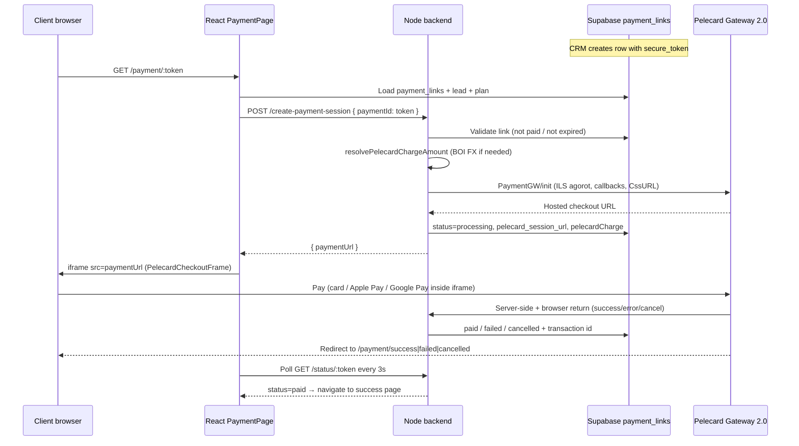
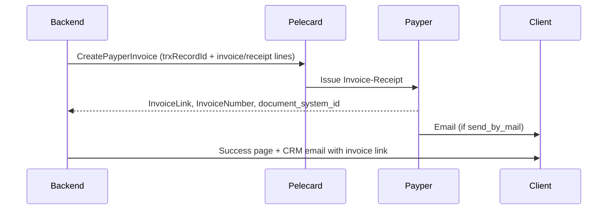

# Pelecard payment checkout — how it works

Guide for developers and operations: public payment page (`PaymentPage`), backend integration, and what **Pelecard** must configure for **Apple Pay** and **Google Pay**.

Related code:

| Layer | Main files |
| ----- | ---------- |
| Public checkout UI | `src/pages/PaymentPage.tsx`, `src/components/PelecardCheckoutFrame.tsx` |
| Frontend API client | `src/lib/pelecardPaymentApi.ts`, `src/lib/pelecardErrors.ts` |
| Result pages | `src/pages/PaymentResultPage.tsx` → `/payment/success`, `/payment/failed`, `/payment/cancelled` |
| Payment link creation | `src/lib/proformaPaymentLink.ts`, `src/lib/paymentLinkQueries.ts` |
| Backend API | `backend/src/controllers/pelecardPaymentController.js`, `backend/src/routes/pelecardPaymentRoutes.js` |
| Pelecard gateway | `backend/src/services/pelecardService.js` |
| Payper invoice | `backend/src/services/payperInvoiceService.js`, `backend/src/services/payperRefundService.js` |
| Charge amount / FX | `backend/src/services/paymentChargeAmountService.js` |
| Reconciliation | `backend/src/services/pelecardPaymentReconciliationService.js` |
| Env template | `backend/env.pelecard.example` |
| DB columns | `sql/2026-05-24_payment_links_pelecard.sql`, `sql/2026-06-23_payment_links_payper.sql` |

---

## End-to-end flow



### 1. Payment link (CRM → database)

A row in **`payment_links`** is created when staff generate a proforma / payment request (see `ensureProformaPaymentLink` in `src/lib/proformaPaymentLink.ts`).

Important fields:

| Field | Purpose |
| ----- | ------- |
| `secure_token` | Public id in URL: `/payment/:token` |
| `payment_plan_id` | Links to `payment_plans` or legacy `finances_paymentplanrow` |
| `amount`, `vat_amount`, `total_amount`, `currency` | Invoice amounts (may be USD/EUR/GBP) |
| `status` | `pending` → `processing` → `paid` / `failed` / `cancelled` / `expired` |
| `expires_at` | Link expiry (default ~30 days on create) |
| `pelecard_*` | Session URL, transaction id, status codes, raw JSON |

Public URL pattern: `https://<APP_PUBLIC_URL>/payment/<secure_token>`

### 2. PaymentPage loads the link

`src/pages/PaymentPage.tsx`:

1. Reads `token` from the route.
2. Fetches `payment_links` from Supabase by `secure_token`.
3. Enriches with lead data (`leads` or `leads_lead`), payment plan row, and **billing contact** (`resolvePaymentPlanContact`).
4. If already paid → shows “Payment done” stamp (no iframe).
5. If expired / cancelled → error message.
6. Otherwise loads **BOI exchange preview** (`fetchProformaExchangeRateInfo`) for the summary card when currency is not ILS.
7. Calls **`createPelecardPaymentSession(token)`** automatically when payment is allowed.
8. Embeds **`PelecardCheckoutFrame`** with the returned `paymentUrl`.
9. **Polls** `fetchPaymentStatus` every 3 seconds while the iframe is open and redirects to success/failed/cancelled when status changes.

Card data never touches our servers. The footer states: *“Processed securely by Pelecard.”*

### 3. Backend creates a Pelecard session

**`POST /api/payments/pelecard/create-payment-session`**

Body: `{ "paymentId": "<secure_token>" }`

Steps (`pelecardPaymentController.js`):

1. Load payment link; reject if missing, paid, or expired.
2. **Reconcile** if status is `processing` or `failed` (recover charges that succeeded at Pelecard but failed to save locally).
3. Call `pelecardService.createPaymentSession()`:
   - **`resolvePelecardChargeAmount`**: converts foreign currency to **ILS** using latest **Bank of Israel** rates in `boi_exchange_rates` (Pelecard always charges in ILS, `Currency: '1'`).
   - **`PaymentGW/init`** with terminal credentials, amount in **agorot** (`Total`), `ActionType: 'J4'`, `ShopNo: '001'`, `ParamX` = secure token.
   - **E-commerce classification**: `J4` + CVV required + phone hidden; never `AuthNum` (telephone/MOTO). `CustomerIdField: must` is kept for Israeli issuers.
   - **Return URLs** point to **`BACKEND_PUBLIC_URL`** (`/api/payments/pelecard/return/success|error|cancel`), not the React app directly.
   - **Display options**: `CssURL`, language, cardholder prefill, email field, iframe-safe flags (`FeedbackOnTop: 'False'`, `Target: '_self'`).
   - Sandbox: `QAResultStatus: '000'` when `PELECARD_SANDBOX=true`.
4. Save `pelecard_session_url`, `pelecard_confirmation_key`, `pelecard_raw_response.pelecardCharge`, `status: 'processing'`.
5. Return `{ paymentUrl, cssUrl, cssApplied }` to the frontend.

### 4. Hosted checkout (iframe)

`PelecardCheckoutFrame.tsx` loads Pelecard’s URL in an **iframe**:

- `allow="payment; publickey-credentials-get *"` — required for **Payment Request API** (Apple Pay / Google Pay in supporting browsers).
- `FeedbackOnTop: 'False'` on init — prevents Pelecard from breaking out of the iframe (`Target=_top`), which browsers block cross-origin.
- Dynamic iframe height on mobile (postMessage + fallbacks) so wallet buttons and the form are not clipped.

The client completes payment **inside Pelecard’s page**. We do not implement wallet buttons in React.

### 5. Return callbacks and verification

Pelecard calls our backend (GET/POST):

| Route | Outcome |
| ----- | ------- |
| `/api/payments/pelecard/return/success` | Verify transaction via `GetTransaction`, mark paid, update `payment_plans` / legacy plan |
| `/api/payments/pelecard/return/error` | Mark failed with Pelecard status code |
| `/api/payments/pelecard/return/cancel` | Mark `cancelled` |

Then Pelecard redirects the browser to **`APP_PUBLIC_URL`**:

- `/payment/success?paymentId=…`
- `/payment/failed?paymentId=…&pelecardStatus=…`
- `/payment/cancelled?paymentId=…`

`PaymentResultPage` may break out of the iframe (`window.top.location`) and optionally re-fetch status from **`GET /api/payments/pelecard/status/:paymentId`**.

### 6. Reconciliation (safety net)

If a charge succeeds at Pelecard but DB update fails:

- Status polling and return handler call `tryReconcilePaymentLink`.
- Optional scheduler: `ENABLE_PELECARD_RECONCILE_SCHEDULER` (see `backend/env.pelecard.example`).
- Manual ops: **`POST /api/payments/pelecard/reconcile/:paymentId`** with optional `transactionId`.

On success, a **payment confirmation email** may be sent (template id 184, Microsoft Graph mailbox).

### 7. Payper tax invoice-receipt (CreatePayperInvoice)

After a successful charge, the backend calls **Pelecard `CreatePayperInvoice`** with `typeDocument: "Invoice-Receipt"`. Payper generates the legal document and can email it to the client (`send_by_mail: true`).



**Implementation:** `backend/src/services/payperInvoiceService.js`, hooked from `persistPaymentSuccess` in `pelecardPaymentReconciliationService.js`.

**Stored on `payment_links`:** `payper_invoice_link`, `payper_invoice_number`, `payper_document_system_id`, `payper_invoice_status`, `pelecard_customer_id`.

**Client delivery:**

1. Payper email (when `PAYPER_SEND_BY_MAIL=true`)
2. Payment success page — “View tax invoice” button (`PaymentResultPage.tsx`)
3. CRM confirmation email — `{invoice_link}` / `{invoice_number}` placeholders (template 184)

**Ops / recovery:**

- Status poll retries invoice creation for paid links: `GET /api/payments/pelecard/status/:paymentId`
- Manual retry: `POST /api/payments/pelecard/create-payper-invoice/:paymentId`
- Scheduler batch: `reconcilePendingPayperInvoices` (runs with Pelecard reconciliation)

**Refunds (phase 2):** `backend/src/services/payperRefundService.js` — Credit document (with `trxRecordId` + `reference_document_id`), then Receipt (no `trxRecordId`).

**Prerequisites (confirm with Pelecard):**

- Payper enabled on your terminal
- Valid `PAYPER_INCOME_ID` for your Payper account
- `GetTransaction` returns card metadata for `receipt_lines` (last 4, expiry, brand)

| Variable | Role |
| -------- | ---- |
| `AUTOMATED_INVOICE` | `true` to auto-create invoices after payment (default `false`) |
| `ENABLE_PAYPER_INVOICE` | Legacy master switch; `false` disables manual retry too |
| `PELECARD_PAYPER_INVOICE_PATH` | Default `PaymentGW/CreatePayperInvoice` |
| `PAYPER_INCOME_ID` | Payper income category (sample: `-100000000`) |
| `PAYPER_SEND_BY_MAIL` | Payper emails client directly |
| `PAYPER_INCLUDE_VAT` | `include_vat` on invoice lines |

Run SQL: `sql/2026-06-23_payment_links_payper.sql`, `sql/2026-06-23_payment_links_pelecard_profile.sql`

### 8. Dual terminal profiles (production + sandbox test)

Use **two separate Pelecard terminals** on one backend: live production credentials and a sandbox/test terminal for the Render staging frontend only.

| Variable | Role |
| -------- | ---- |
| `PELECARD_TERMINAL` / `USER` / `PASSWORD` | Production — **rainmakerqueen.org** and all other domains |
| `PELECARD_SANDBOX_TERMINAL` / `USER` / `PASSWORD` | Test terminal — **only** when checkout starts from [https://rainmakerqueen.onrender.com](https://rainmakerqueen.onrender.com) |
| `PELECARD_SANDBOX_FRONTEND_ORIGINS` | Optional override (default: `https://rainmakerqueen.onrender.com` only) |
| `PELECARD_SANDBOX_APP_PUBLIC_URL` | Optional override (default: `https://rainmakerqueen.onrender.com`) |

**How it works:**

1. User opens a payment link on **rainmakerqueen.onrender.com** → browser sends `Origin: https://rainmakerqueen.onrender.com`
2. Backend matches that origin → uses `PELECARD_SANDBOX_*` test terminal
3. `payment_links.pelecard_profile` is set to `sandbox` (run SQL migration)
4. Pelecard callbacks and `GetTransaction` use the same stored profile
5. Return redirects go to **rainmakerqueen.onrender.com** (not production `APP_PUBLIC_URL`)

**rainmakerqueen.org**, localhost, and any other origin always use the production terminal. There is no header/body override to force sandbox.

Debug: `GET /api/payments/pelecard/checkout-css-info?profile=sandbox` probes the test terminal.

---

## Environment variables (backend)

Copy from `backend/env.pelecard.example`. **Never** put terminal password in the frontend.

| Variable | Role |
| -------- | ---- |
| `PELECARD_BASE_URL` | Default `https://gateway20.pelecard.biz` |
| `PELECARD_TERMINAL` | Terminal number |
| `PELECARD_USER` / `PELECARD_PASSWORD` | API credentials |
| `PELECARD_SANDBOX` | `true` → auto-approve test charges (`QAResultStatus=000`) |
| `APP_PUBLIC_URL` | Frontend base (redirects after pay) |
| `BACKEND_PUBLIC_URL` | Backend base (Pelecard server callbacks) — must be **HTTPS** in production |
| `PELECARD_CSS_VARIANT` | Built-in checkout theme `1`–`4` (English: `1` or `4`) |
| `PELECARD_CHECKOUT_LANGUAGE` | `en` or `he` |
| `PELECARD_CSS_URL` | Optional external CSS (Pelecard must **whitelist** the domain) |
| `PELECARD_LOGO_URL` | Optional logo in iframe header |

Debug endpoint (ops): **`GET /api/payments/pelecard/checkout-css-info`** — shows which `CssURL` is sent and whether it appears on the checkout HTML.

Frontend:

| Variable | Role |
| -------- | ---- |
| `VITE_BACKEND_URL` | API base in production; dev uses Vite `/api` proxy when backend is localhost |

---

## Currency and amounts

- **Display** on `PaymentPage`: original currency + optional **Total (NIS)** from BOI rates (`proformaExchangeRate.ts`).
- **Charge** at Pelecard: always **ILS**; `Total` = `round(total × rate) × 100` agorot.
- At session creation, `pelecardCharge` (rate, `chargeTotalNis`, `lockedAt`) is stored on `payment_links.pelecard_raw_response` and `payment_links.rate`.
- If BOI rates are missing for a foreign currency, session creation returns **503** (`EXCHANGE_RATE_UNAVAILABLE`).

---

## Apple Pay and Google Pay

### Apple domain verification (merchant site)

Apple Pay requires a domain association file on your **public payment domain** (no redirects):

`https://rainmakerqueen.org/.well-known/apple-developer-merchantid-domain-association.txt`

This repo ships the file at:

`public/.well-known/apple-developer-merchantid-domain-association.txt`

After deploy, verify with:

```bash
curl -I https://rainmakerqueen.org/.well-known/apple-developer-merchantid-domain-association.txt
```

Expect **HTTP 200**, `Content-Type: text/plain`, and **no** redirect to `www` or another host. During Apple’s verification, Pelecard may ask you to **disable reverse-proxy** on that path temporarily.

`staticwebapp.config.json` and `vercel.json` exclude `/.well-known/*` from SPA fallback so the file is served as a static asset.

### Pelecard ClientSecureV2 (parent page script)

`PaymentPage` loads once per visit:

`https://gateway21.pelecard.biz/Scripts/Payment/ClientSecureV2.js`

See `src/lib/pelecardWalletSetup.ts`. (Pelecard notes this step may be optional for Gateway 2.0 plugin ≥ 1.5.1; we load it for wallet support in the iframe.)

### How our integration handles wallets

**We do not call separate Apple Pay or Google Pay APIs.** Pelecard Gateway 2.0 renders wallet buttons on the **hosted checkout page** inside the iframe when:

1. Pelecard has **enabled** Apple Pay and/or Google Pay on your **terminal**.
2. The payer uses a **supported device and browser** (e.g. Safari + Apple Pay, Chrome + Google Pay).
3. The checkout session is valid (ILS charge, successful `init`).

Our code only ensures the iframe can host wallet flows:

```html
allow="payment; publickey-credentials-get *"
```

Init flags that keep checkout embeddable (required for mobile wallets in iframe):

- `UseBuildInFeedbackPage: 'False'`
- `FeedbackOnTop: 'False'`
- `Target: '_self'`

Optional styling when using **custom** `PELECARD_CSS_URL` (`public/pelecard-checkout.css` includes `.apple-pay-button` rules). Built-in variants (`PELECARD_CSS_VARIANT`) use Pelecard’s own wallet button layout.

There is **no** extra field in our `PaymentGW/init` payload to “turn on” wallets — visibility is controlled by **Pelecard terminal configuration**.

### What Pelecard must do (action list for Pelecard support)

Provide Pelecard with:

| Item | Why |
| ---- | --- |
| **Terminal number** (`PELECARD_TERMINAL`) | Wallet features are enabled per terminal |
| **Merchant / company name** | Shown on Apple Pay / Google Pay sheets |
| **Public site URL** (`APP_PUBLIC_URL`, e.g. `https://rainmakerqueen.org`) | HTTPS required; used for checkout and redirects |
| **Backend callback URL** (`BACKEND_PUBLIC_URL`) | Server-side success/error notifications |
| Request: **Enable Apple Pay** on this terminal | See [Pelecard Apple Pay](https://pelecard.com/apple-pay/) |
| Request: **Enable Google Pay** on this terminal | See [Pelecard Google Pay](https://pelecard.com/google-pay/) |

**Apple Pay (Pelecard-side, typical process):**

1. Pelecard enables Apple Pay on the merchant terminal.
2. Pelecard / acquirer completes **Apple Merchant ID** registration and **domain verification** for domains that host checkout (your public payment domain).
3. For **iframe** checkout, confirm with Pelecard that Apple Pay is supported for **Gateway 2.0 embedded** (`PaymentGW/init`) flows, not only full-page redirect.
4. Test on **real iOS Safari** with a card in Wallet (simulator / desktop Safari may not show the button).

**Google Pay (Pelecard-side, typical process):**

1. Pelecard enables Google Pay on the same terminal.
2. Google Pay merchant profile is linked through Pelecard’s acquiring setup.
3. Test on **Chrome/Android** with Google Pay configured.

**General requirements (both wallets):**

- Production **HTTPS** on frontend and backend public URLs.
- Active **card** clearing on the terminal (wallets tokenize card networks; Pelecard docs assume card processing is enabled).
- **Sandbox** (`PELECARD_SANDBOX=true`): wallet buttons may be **hidden or non-functional**; validate wallets in **production** or Pelecard’s live test terminal.
- **ILS** charges: our integration always sends `Currency: '1'` (NIS); confirm with Pelecard that wallet transactions settle correctly when the invoice was quoted in USD/EUR (we convert using BOI before `init`).

**What to ask Pelecard support (copy-paste):**

> We use Pelecard Gateway 2.0 `PaymentGW/init` with embedded iframe checkout (`FeedbackOnTop=False`, `Target=_self`). Terminal: **[TERMINAL]**. Please enable **Apple Pay** and **Google Pay** on this terminal, complete any required Apple domain verification for **[APP_PUBLIC_URL]**, and confirm wallet buttons appear on the hosted payment page for iframe integration. Public callbacks: **[BACKEND_PUBLIC_URL]/api/payments/pelecard/return/**.

### How to verify wallets after Pelecard enables them

1. Open a live payment link: `/payment/<token>` (not sandbox if wallets only work in prod).
2. Wait for the Pelecard iframe to load.
3. **iPhone Safari**: look for **Apple Pay** on the Pelecard form (not on our purple summary panel).
4. **Android Chrome**: look for **Google Pay**.
5. Complete a small real or test transaction; confirm `payment_links.status` → `paid` and `pelecard_transaction_id` is set.
6. If buttons are missing after Pelecard confirms enablement: check device/browser support, try built-in CSS `PELECARD_CSS_VARIANT=4`, and call `GET /api/payments/pelecard/checkout-css-info` to ensure checkout HTML loads correctly.

---

## Payment link statuses

| Status | Meaning |
| ------ | ------- |
| `pending` | Link created; checkout not started |
| `processing` | Pelecard session created; client in checkout |
| `paid` | Verified success; plan marked paid |
| `failed` | Declined or error (see `pelecard_status_code`) |
| `cancelled` | User cancelled checkout |
| `expired` | Past `expires_at` |

Common Pelecard status codes (`src/lib/pelecardErrors.ts`):

| Code | Meaning |
| ---- | ------- |
| `000` | Approved |
| `002` | Card declined |
| `301`–`302` | Checkout session expired — open link again |
| `113` | Acquirer/terminal config issue with ID on internet checkout (Shva vector 41) — ask Pelecard to enable CNP with required ID, not telephone/MOTO |
| `303` | Terminal not authorized for card-not-present / internet transaction |

---

## Local development notes

- Frontend: `npm run dev` (Vite proxies `/api` → backend when `VITE_BACKEND_URL` is localhost).
- Backend must have Pelecard env vars; use `PELECARD_SANDBOX=true` for fake approvals.
- Pelecard **cannot** fetch `CssURL` from `localhost` — use **`PELECARD_CSS_VARIANT=4`** (built-in gateway CSS).
- `BACKEND_PUBLIC_URL` for local testing often requires **ngrok** (or similar) so Pelecard can POST return callbacks.

---

## Security summary

- Terminal credentials live **only** on the backend.
- Clients only receive a short-lived **Pelecard hosted URL**.
- Payment outcome is verified server-side (`GetTransaction`) before marking paid.
- `secure_token` is an unguessable opaque id; links expire.

For CSS / branding issues, prefer `PELECARD_CSS_VARIANT` over external `PELECARD_CSS_URL` unless Pelecard has whitelisted your static file host.
